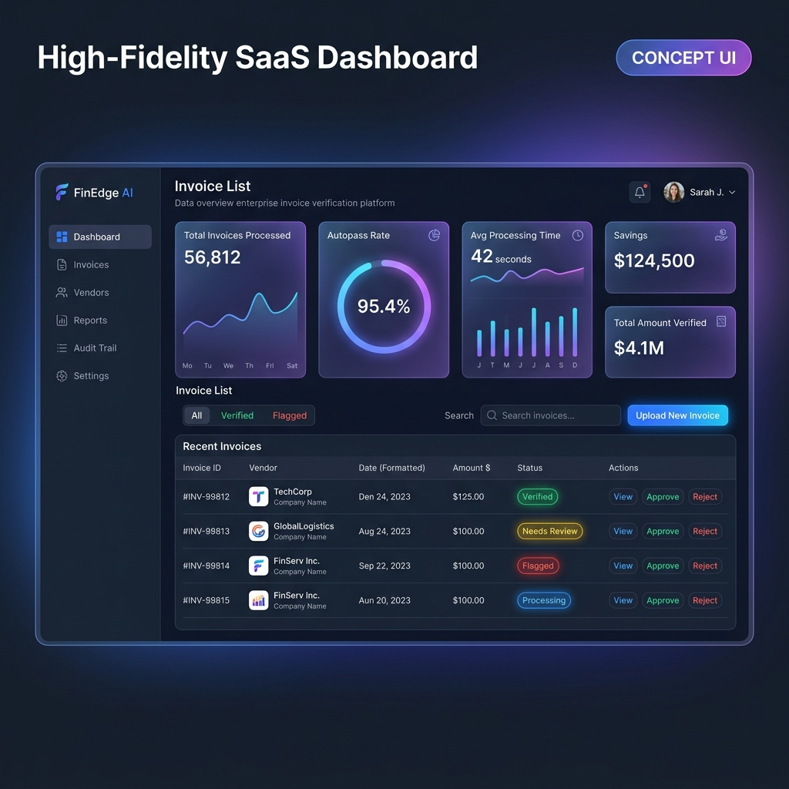
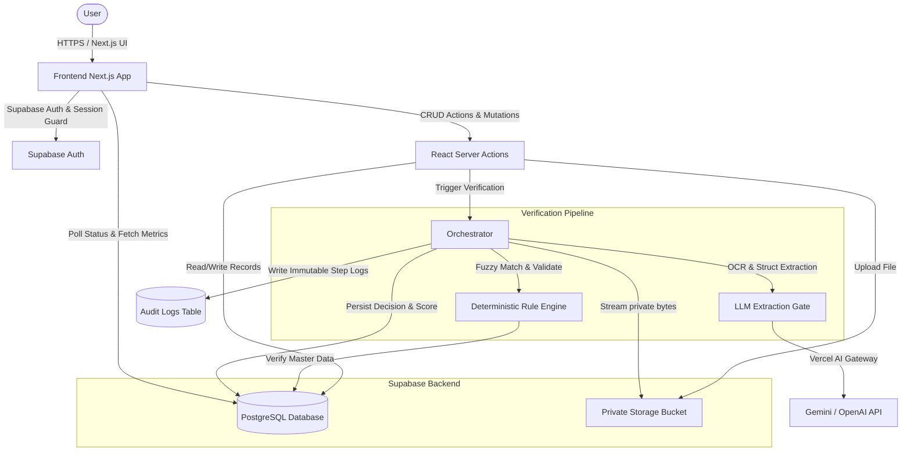
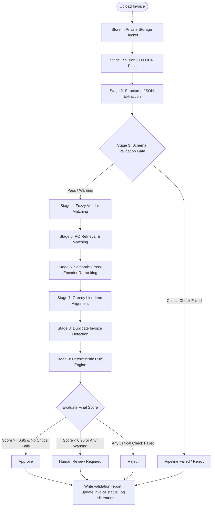
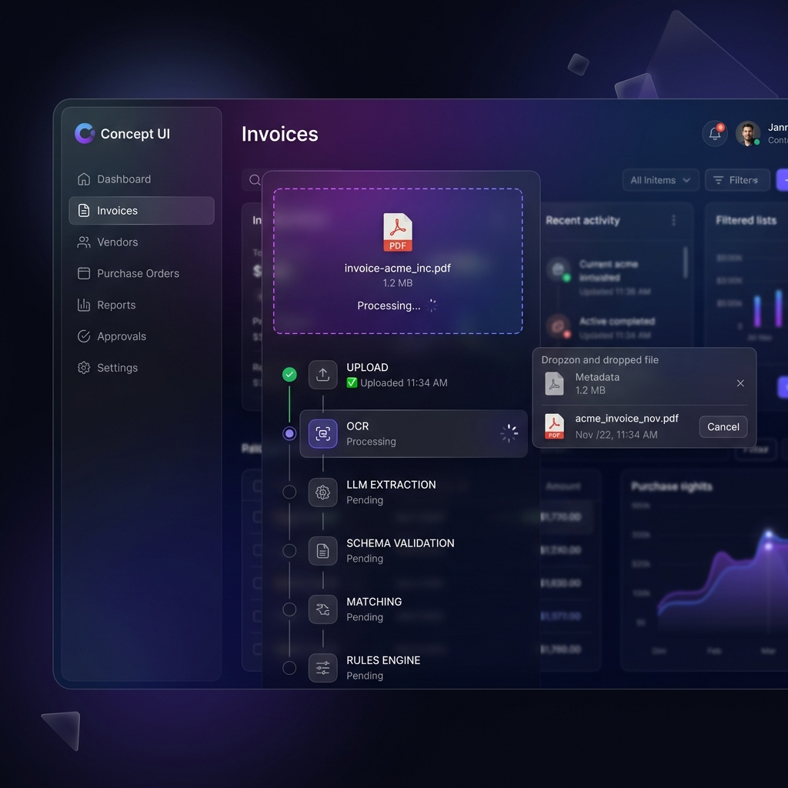
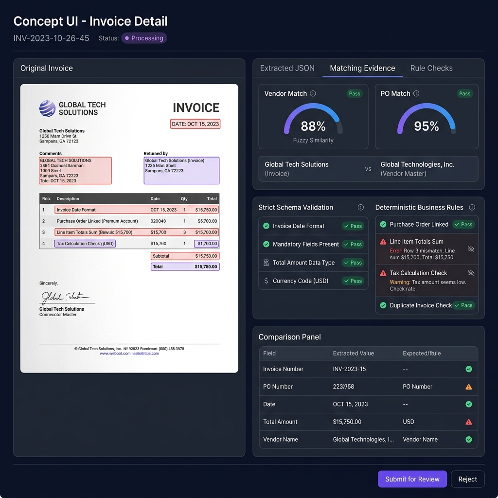
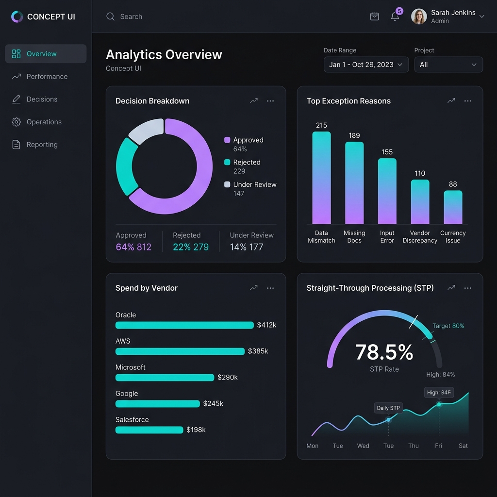
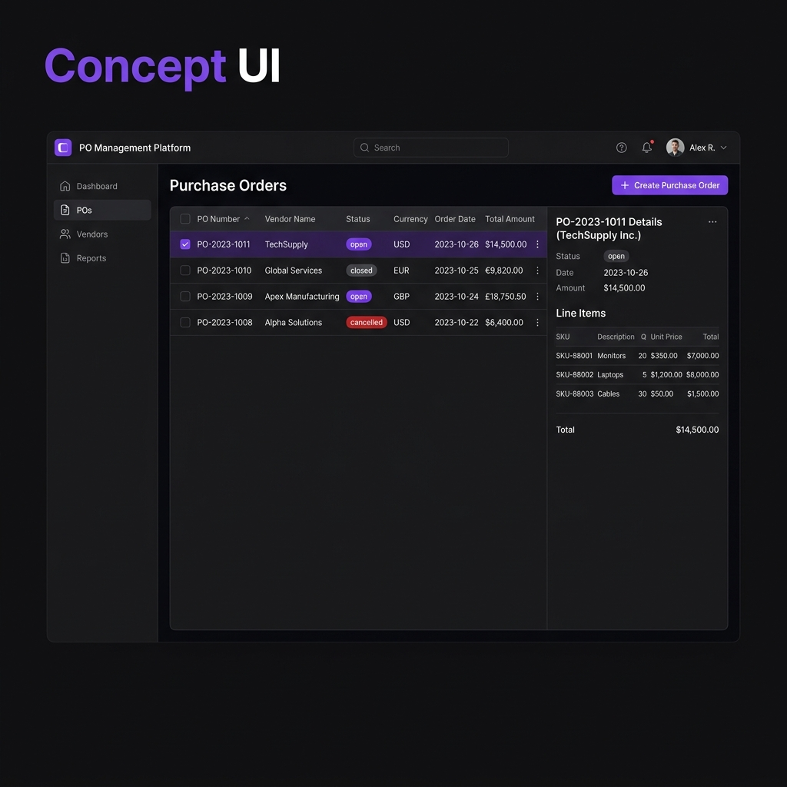
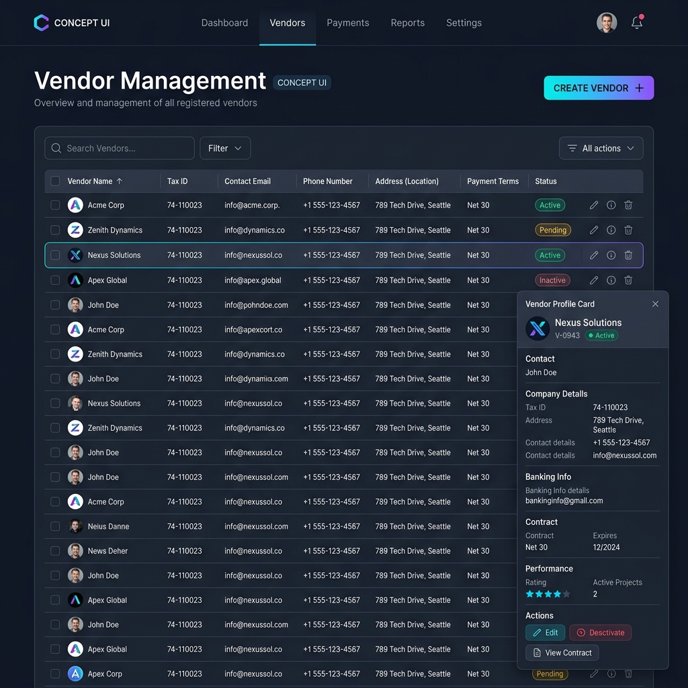

# Reconcile

A deterministic-first AI-powered Procure-to-Pay (P2P) Invoice Verification Platform.

> **"AI performs perception. Deterministic algorithms make financial decisions."**

---

## Hero Section

<div align="center">
  

  <h3>Enterprise Procure-to-Pay (P2P) Invoice Verification</h3>

  <p>
    Automate invoice ingestion and validation with the precision of deterministic algorithms, powered by Gemini Vision OCR and Supabase.
  </p>

  <!-- Badges -->
  <p>
    
    
    
    
    
  </p>

  <p>
    
    
    
  </p>
</div>

---

## Overview

### What is Reconcile?
Reconcile is a high-fidelity invoice verification platform designed to automate accounts-payable (AP) workflows. Traditional AP processes are highly manual, requiring teams to manually cross-reference paper or digital invoices against purchase orders and vendor registers to detect overbilling, duplicates, pricing mismatches, and currency discrepancies. 

Reconcile modernizes this process by combining state-of-the-art vision models for document transcription with rigorous, deterministic backend code for financial validation.

### The Business Problem
Accounts payable departments face a double-bind when automating invoice processing:
1. **Manual processing is too slow and expensive**, creating bottlenecks and leading to missed early-payment discounts.
2. **Pure-AI automation is unsafe.** Large Language Models (LLMs) excel at processing unstructured data, but they are inherently probabilistic. They hallucinate numbers, misinterpret decimal placements, invent vendors, and lack the mathematical guarantees required for financial accounting and audit readiness.

### The "Zero-Hallucination" Solution
Reconcile implements a strict separation of concerns:
* **AI for Perception:** A vision-based LLM (`openai/gpt-4o` or Google Gemini) acts as the "eyes" of the system, transcribing text (OCR) and mapping unstructured document fields into a structured JSON schema.
* **Deterministic Rules for Decisions:** The structured data is immediately fed into a deterministic pipeline written in TypeScript. Every vendor lookup, PO correlation, line-item alignment, and tolerance check is performed outside the LLM. 
* **Immutable Audit Trail:** All pipeline steps, fuzzy-matching scores, and rule check details are logged to a tamper-proof database audit table, providing explainability for every single system action.

---

## Key Features

*   **AI-Powered Invoice Extraction:** Seamlessly extracts header data and complex line-item structures from scanned images and PDFs.
*   **Gemini Vision Integration:** Utilizes high-accuracy vision models via the Vercel AI Gateway for dual-pass OCR and structured output.
*   **Deterministic Validation Gate:** Rejects malformed AI payloads immediately at a pre-trust schema check before downstream databases are accessed.
*   **Purchase Order Matching:** Correlates extracted invoice numbers against master purchase orders using an exact-first fuzzy matching strategy.
*   **Vendor Matching:** Resolves extracted vendor names against master databases using weighted Levenshtein and token-set string similarity.
*   **Line-Item Alignment:** Greedily pairs invoice items to PO items based on SKU matches and description similarities, calculating price and quantity variances.
*   **Duplicate Invoice Detection:** Checks historical databases to ensure no invoice with the same vendor and invoice number has been processed.
*   **Human Review Workflow:** Automatically routes low-confidence or high-variance invoices to a human approval queue while auto-approving low-risk invoices.
*   **Immutable Audit Logs:** Tracks pipeline durations and payloads step-by-step for absolute transparency and compliance reporting.
*   **Analytics Dashboard:** Visualizes straight-through processing rates, top exception reasons, spend distribution, and savings.
*   **Configurable Business Rules:** Supports per-user tolerances for unit-price creep (default 5%) and invoice-total mismatch (default 2%).
*   **Supabase Backend:** Leverages PostgreSQL for relational integrity, file storage, and serverless authentication.
*   **Secure Authentication:** Integrates user signup and session verification out of the box.
*   **Row-Level Security (RLS):** Protects tenant data by enforcing user-level isolation policies on database tables and file storage.
*   **Responsive UI:** Provides a dark-themed, glassmorphic, mobile-friendly interface designed with `@base-ui/react` and Tailwind CSS.

---

## System Architecture

Reconcile is built as a unified Next.js App Router application that coordinates frontend interactions, Supabase data persistence, private document storage, and LLM processing gates.

### High-Level System Diagram



### Verification Pipeline Workflow

Below is the execution flow that runs server-side when an invoice is processed:



---

## Technology Stack

The platform is engineered with a modern, serverless JavaScript ecosystem optimized for safety, speed, and clean code patterns.

| Category | Technology | Purpose |
| :--- | :--- | :--- |
| **Frontend** | Next.js 16.2.6 (App Router), React 19, TypeScript 5.7 | Component architecture, Server Component data fetching, routing, static type-safety |
| **Styling** | Tailwind CSS v4, `@base-ui/react`, Lucide Icons, Sonner | Glassmorphism UI tokens, custom unstyled headless components, responsive icons, toast feedback |
| **Backend** | React Server Actions, Route Handlers | Secure backend processing logic, custom file streaming APIs |
| **Database** | Supabase (PostgreSQL), Drizzle ORM (for schema reference) | Relational database engine, index structures, SQL queries |
| **Authentication** | Supabase Auth | Session cookies, secure email/password credential signup, session middleware guard |
| **Storage** | Supabase Storage (Private Buckets) | Storing uploaded invoice files under secure user-specific folder prefixes |
| **AI / OCR** | Vercel AI SDK (`ai` v7), Google Gemini Pro / GPT-4o, Zod v4 | Dual-pass OCR, Zod structured output typing, Vercel AI Gateway abstraction |
| **Validation** | Custom Rule Engine | Pure, testable TypeScript verification modules, Levenshtein distance, token overlap calculations |
| **Deployment** | Vercel Platform, Vercel Analytics | Production hosting, continuous integrations, web telemetry |
| **Testing** | Vitest 4.1.10 | Fast unit testing for pure validation functions, fuzzy matching logic, and rules |

---

## Project Structure

Reconcile is organized into clean layers separating UI views, server actions, database schema definitions, and pure validation algorithms.

```
reconcile/
├── app/                      # Next.js App Router root
│   ├── (app)/                # Authenticated application view files (Route Group)
│   │   ├── analytics/        # Business intelligence and exceptions reporting view
│   │   ├── audit-log/        # System compliance steps audit log
│   │   ├── dashboard/        # Main landing KPIs and zero-hallucination indicators
│   │   ├── invoices/         # Invoices lists, upload dialogs, and detail views
│   │   ├── purchase-orders/  # PO list and detail items view
│   │   ├── vendors/          # Master vendor data table
│   │   ├── settings/         # Tolerances and configuration details view
│   │   ├── layout.tsx        # Session authentication check & sidebar wrapper
│   │   └── loading.tsx       # Route loading page skeleton UI
│   ├── actions/              # Server Actions ("use server") forming the backend mutations API
│   ├── api/                  # Catch-all REST endpoints for file upload, streaming, and auth
│   ├── globals.css           # Tailwind v4 globals, animations, and color system variables
│   ├── layout.tsx            # Global layout wrapper (fonts, toaster, theme configuration)
│   └── page.tsx              # Root URL page, redirects users according to session state
├── components/               # React UI Components
│   ├── analytics/            # Progress bars and statistics details widgets
│   ├── audit/                # Log tables and JSON detail dialogs
│   ├── invoices/             # Invoice detail tabs, upload steppers, and rules checklists
│   ├── ui/                   # shadcn-style primitive inputs, buttons, cards, and tables
│   └── app-sidebar.tsx       # Main navigation panel
├── docs/                     # Project documentation assets
│   └── images/               # High-fidelity Concept UI wireframes and images
├── lib/                      # Core backend and business validation modules
│   ├── ai/                   # AI Gateway connectivity, prompts, and extraction models
│   ├── db/                   # Database client initializer
│   ├── matching/             # Fuzzy matching, Levenshtein utilities, and PO/Vendor pairing
│   ├── pipeline/             # Core orchestrator executing validation stages
│   ├── rules/                # Deterministic rule evaluator and scoring engine
│   ├── supabase/             # Supabase clients (client, server, and middleware)
│   └── validation/           # Inbound AI data schema checks
├── public/                   # Static directory (sample invoice assets)
├── supabase/                 # Supabase configuration and database migrations
│   └── migrations/           # PostgreSQL migration scripts containing table declarations
├── package.json              # Project scripts, npm runtime, and development dependencies
├── vitest.config.ts          # Vitest testing environment configuration
└── projectdoc.txt            # System technical handbook
```

---

## Verification Pipeline

Reconcile implements a detailed 12-stage pipeline to transform an uploaded document into a validated financial decision, logging every step to `audit_logs` with precise timestamp offsets.

```
[ Upload ]
    │
    ▼
[  OCR   ] ──► Uses vision LLM to transcribe all visible text.
    │
    ▼
[Extract ] ──► Extracts structured JSON from OCR text with strict Zod types.
    │
    ▼
[Schema  ] ──► Validates fields deterministically; fails on missing crucial columns.
    │
    ▼
[Vendor  ] ──► Matches vendor name fuzzy (Levenshtein + Token-Set, threshold >= 0.55).
    │
    ▼
[PO Retr ] ──► Loads open POs; matches exact PO number (confidence 1.0) or falls back.
    │
    ▼
[Fuzzy   ] ──► Calculates PO number, vendor name, and total amount similarity.
    │
    ▼
[Rerank  ] ──► Cross-encoder surrogate ranks top PO candidates based on textual context.
    │
    ▼
[Line Al ] ──► Greedily assigns invoice line items to PO items (sku match > description).
    │
    ▼
[Duplicat] ──► Verifies database for invoice number duplicates.
    │
    ▼
[Rules   ] ──► Evaluates weighted rules (currency, total tolerance, unit-price creep).
    │
    ▼
[Decision] ──► finalizes decision (Approve / Review / Reject) and writes logs.
```

### Detailed Pipeline Stages
1. **Upload:** Client uploads an image or PDF to `/api/blob/upload`. The server saves the file inside a private Supabase Storage bucket and writes an `invoices` row in state `uploaded`.
2. **OCR:** The orchestrator reads the file stream server-side and sends it to the vision LLM for raw textual transcription, recording results in `ocr_text`.
3. **Structured Extraction:** A second LLM pass utilizes structured JSON output mode to map the OCR text into a concrete schema (fields: invoice number, vendor name, invoice date, purchase order number, currency, subtotal, tax, total amount, and line items array).
4. **Schema Validation:** The system runs a deterministic schema validation test (`validateInvoiceSchema`) on raw AI extraction results. Key fields must be present and numbers must be valid. If critical schema checks fail, the pipeline proceeds but marks the invoice for rejection.
5. **Vendor Matching:** Extracted vendor names are matched against registered master data. The algorithm scores similarity based on edit distance and token overlap. If the confidence is below `0.55`, a warning is logged.
6. **Purchase Order Retrieval:** The database retrieves all open purchase orders for the session user.
7. **Fuzzy Matching:** If the extracted PO number does not match exactly, the system runs a weighted fuzzy match based on PO number similarity, vendor name match, and invoice total proximity (threshold `0.6`).
8. **Semantic Re-ranking:** A simulated cross-encoder model reranks candidates using joint query-context similarity, sharpening the final match candidate.
9. **Line-Item Alignment:** The greedy match algorithm (`matchLineItems`) links each invoice line item to its corresponding PO line item. SKU exact matching is prioritized, falling back to description similarity.
10. **Duplicate Detection:** The system performs a database lookup on `(user_id, invoice_number, vendor_name)` to identify potential duplicate bills.
11. **Deterministic Rule Engine:** The invoice is run through the rule checker, assessing criteria like currency equivalence, arithmetic integrity, PO total within tolerance (default 2%), unit-price creep (default 5%), and quantities matching PO limits.
12. **Approve / Review / Reject & Audit Logging:** The pipeline calculates a final weighted score (from 0 to 1). A single critical rule failure results in `reject`. Any warning failure or a score below `0.95` flags the invoice for manual `review`. High scores auto-transition the status to `approve`. A detailed JSON payload and step duration are stored in `audit_logs`.

---

## Dashboard

The Dashboard provides high-level financial context alongside specialized "Zero-Hallucination" performance indicators.

### Key Metrics
*   **Total Invoices:** The total count of invoice documents ingested in the current workspace.
*   **Approved:** Count of invoices successfully auto-approved by the rule engine.
*   **Needs Review:** Invoices flagged for warnings, price discrepancies, or low match scores.
*   **Rejected:** Invoices containing critical failures (e.g., duplicated invoice numbers, total amount over tolerance, currency mismatches).
*   **Verification Success Rate:** The percentage of processed invoices that completed the pipeline without fatal system crashes.
*   **Average Confidence:** The average match confidence of PO and vendor matches across all documents.
*   **Hallucinations Prevented:** Cumulative count of failed schema and business rules checks. This represents instances where deterministic code caught LLM anomalies before they affected billing records.
*   **Average Processing Time:** Total server-side runtime from file upload to final decision.
*   **Manual Review Rate:** The proportion of invoices requiring manual verification.
*   **Auto-Processed Value:** Total financial sum of auto-approved invoices.
*   **PO Value:** Total value of purchase orders stored in the system.
*   **Recent Invoices:** A tabular log of recent invoices, listing vendor names, invoice numbers, totals, and color-coded status badges.

---

## Database

Reconcile operates on 9 core relational tables in the Supabase PostgreSQL database. Tables are structured to enforce data integrity while facilitating fast reads and updates.

### 1. `vendors`
Stores registered vendor accounts used during fuzzy matching.
*   `id` (BIGINT, Primary Key): Unique row identifier.
*   `user_id` (UUID, Foreign Key -> `auth.users`): Identifies the tenant owner.
*   `name` (TEXT, Not Null): Trade name of the vendor.
*   `tax_id` (TEXT): Tax identifier (EIN/VAT).
*   `email` / `phone` / `address` (TEXT): Vendor contact information.
*   `payment_terms` (TEXT): Default terms (e.g., "Net 30").

### 2. `purchase_orders`
Stores order header information.
*   `id` (BIGINT, Primary Key): Unique row identifier.
*   `user_id` (UUID, Foreign Key -> `auth.users`): Owner reference.
*   `po_number` (TEXT, Not Null): Human-readable PO identifier (unique per user).
*   `vendor_id` (BIGINT, Foreign Key -> `vendors`): Matched vendor id.
*   `vendor_name` (TEXT, Not Null): Denormalized vendor name.
*   `status` (TEXT): Status string (`open`, `partially_received`, `closed`, `cancelled`).
*   `currency` (TEXT): Transaction currency (default `USD`).
*   `subtotal` / `tax` / `total_amount` (NUMERIC): Financial summaries.

### 3. `purchase_order_items`
Contains detailed line items for purchase orders.
*   `id` (BIGINT, Primary Key): Line item identifier.
*   `user_id` (UUID): Tenant identifier.
*   `po_id` (BIGINT, Foreign Key -> `purchase_orders`): Parent PO link.
*   `description` (TEXT): Item description.
*   `sku` (TEXT): Stock Keeping Unit.
*   `quantity` / `unit_price` / `line_total` (NUMERIC): Quantity and cost values.

### 4. `invoices`
Stores metadata and pipeline results for processed invoices.
*   `id` (BIGINT, Primary Key): Unique row identifier.
*   `user_id` (UUID): Owner reference.
*   `file_name` / `file_url` / `file_type` / `file_pathname` (TEXT): Inbound document paths.
*   `status` (TEXT): Pipeline state (`uploaded`, `processing`, `extracted`, `matched`, `validated`, `failed`).
*   `ocr_text` (TEXT): Raw AI OCR text.
*   `extracted` (JSONB): Structured raw fields.
*   `invoice_number` / `vendor_name` / `invoice_date` / `currency` / `total_amount` (TEXT/NUMERIC): Extracted header values.
*   `matched_vendor_id` / `matched_po_id` (BIGINT): Matched entities.
*   `match_confidence` (NUMERIC): Probability score.
*   `decision` (TEXT): Engine decision (`approve`, `review`, `reject`).
*   `validation_score` (NUMERIC): Final rules score (0..1).

### 5. `invoice_items`
Contains line items extracted from the invoice and matched to PO items.
*   `id` (BIGINT, Primary Key): Item identifier.
*   `invoice_id` (BIGINT, Foreign Key -> `invoices`): Parent invoice.
*   `description` / `sku` / `quantity` / `unit_price` / `line_total` (TEXT/NUMERIC): Extracted details.
*   `matched_po_item_id` (BIGINT, Foreign Key -> `purchase_order_items`): Matched PO item.
*   `match_score` (NUMERIC): Line match confidence.

### 6. `validation_reports`
Stores the detailed result checklists from the rule engine.
*   `id` (BIGINT, Primary Key): Report identifier.
*   `invoice_id` (BIGINT, Foreign Key -> `invoices`): Associated invoice.
*   `decision` (TEXT): Decision outcome.
*   `score` (NUMERIC): Scoring ratio.
*   `checks` (JSONB): Complete array of `RuleCheck` objects (names, status, severity, expected/actual values).

### 7. `audit_logs`
Immutable step-by-step pipeline execution logs.
*   `id` (BIGINT, Primary Key): Log entry identifier.
*   `invoice_id` (BIGINT): Link to the associated invoice.
*   `step` (TEXT): Step name (`upload`, `ocr`, `extraction`, `schema`, `matching`, `rules`, `decision`).
*   `status` (TEXT): Outcome status (`started`, `success`, `failed`).
*   `message` (TEXT): Description of the event.
*   `data` (JSONB): Payloads (e.g., matching candidates, confidence ratings).
*   `duration_ms` (INTEGER): Executing time elapsed.

### 8. `user_settings`
User-specific rule tolerances.
*   `user_id` (UUID, Primary Key): Links to user account (unique).
*   `amount_tolerance_pct` (NUMERIC): Allowed mismatch margin on invoice total (default 2% = `0.02`).
*   `price_tolerance_pct` (NUMERIC): Allowed unit price variance per line (default 5% = `0.05`).
*   `auto_approve_threshold` (NUMERIC): Score threshold for auto approvals (default `0.95`).

### 9. `invoice_reviews`
Tracks manual reviews and user notes.
*   `id` (BIGINT, Primary Key): Review identifier.
*   `invoice_id` (BIGINT, Foreign Key -> `invoices`): Invoice reviewed.
*   `action` (TEXT): Action performed (`approve`, `reject`, `comment`).
*   `comment` (TEXT): Reviewer's justification.

---

## Security

Reconcile employs a multi-tiered security model to guarantee data separation, secure access, and system accountability.

*   **Supabase Authentication:** Restricts platform access to authenticated users. Next.js middleware guards application layouts, redirecting unauthorized traffic to the sign-in page.
*   **Row-Level Security (RLS):** All database tables have RLS enabled. Policies mandate that users can only select, insert, update, or delete records where `auth.uid() = user_id`. This prevents cross-tenant data leaks.
*   **Storage Folder Isolation:** Policies on the private `invoices` storage bucket require that objects are uploaded to folders named after the user's UUID. Files can only be downloaded by users whose UUID matches the folder prefix.
*   **Input Validation:** The backend uses Zod schemas to validate REST payloads. File uploads are limited to `image/*` and `application/pdf` with a maximum size limit of 10 MB.
*   **Audit Logging:** Step execution logs are written directly to database tables. The schema does not define UPDATE or DELETE policies for audit log tables, rendering records immutable.

---

## Local Setup

Follow these steps to configure and run the Reconcile development environment.

### Prerequisites
*   Node.js 20+
*   pnpm (v9+ recommended)
*   A Supabase project (local CLI or hosted instance)

### 1. Install Dependencies
Initialize the project packages:
```bash
pnpm install
```

### 2. Environment Variables
Create a `.env.development.local` file in the project root and add the following keys:
```env
# Supabase Configuration
NEXT_PUBLIC_SUPABASE_URL=https://your-project-id.supabase.co
NEXT_PUBLIC_SUPABASE_ANON_KEY=your-anon-key
SUPABASE_SERVICE_ROLE_KEY=your-service-role-key

# AI Gateway and LLM Keys
# On Vercel deployments, Vercel AI Gateway injects ambient keys automatically.
# For local development, define:
AI_GATEWAY_API_KEY=your-openai-or-google-gateway-key
```

### 3. Supabase Database Schema Setup
Apply migrations to initialize the database tables, RLS policies, and triggers:

#### Hosted Supabase Project
Copy the contents of `supabase/migrations/001_initial_schema.sql` and run it in the SQL Editor of your Supabase dashboard.

#### Local Supabase CLI
If developing locally using the Supabase CLI, start the container and apply migrations:
```bash
# Start local supabase container
supabase start

# Apply schema migrations
supabase db reset
```

### 4. Running the Development Server
Launch the Next.js development server:
```bash
pnpm dev
```
Open [http://localhost:3000](http://localhost:3000) in your browser.

### 5. Build Verification
Verify the application compiles without error:
```bash
pnpm build
```

### 6. Executing Tests
Run the Vitest unit tests:
```bash
pnpm test
```

---

## Screenshots

The following wireframes represent the core User Interfaces of the Reconcile application.

### 1. Dashboard UI (Concept UI)
Displays business KPIs alongside "Zero-Hallucination" health metrics (Autopass rate, processing speed, and exceptions prevented).


### 2. Invoice Ingestion & Stepper (Concept UI)
Shows the file dropzone interface alongside the server-side pipeline step-logger.


### 3. Verification Detail Viewer (Concept UI)
Highlights the side-by-side comparison between the original document, extracted fields, and matched purchase orders.


### 4. Advanced Analytics (Concept UI)
Shows exception breakdowns, vendor spend statistics, and straight-through processing rates.


### 5. Purchase Orders Register (Concept UI)
Overview of system purchase orders and line items.


### 6. Vendor Master Register (Concept UI)
Displays registered corporate vendors and their terms.


---

## Roadmap

### Completed Features (Milestone 1)
- [x] Multi-tenant email and password authentication.
- [x] Secure private document ingestion under UUID-scoped storage pathing.
- [x] Dual-pass LLM pipeline (transcription + structured parser).
- [x] Strict validation schema gate rejecting malformed JSON.
- [x] Multi-strategy PO fuzzy matching & Levenshtein vendor similarity.
- [x] Greedy line item SKU and description matching.
- [x] Duplicate invoice database lookup.
- [x] Step-by-step audit logging and latency timers.
- [x] Interactive UI tabs for rules check results.

### Planned Enhancements (Milestone 2)
- [ ] Editable user tolerances and thresholds stored in `user_settings`.
- [ ] Multi-user teams and role-based access levels (e.g., Accountant vs Approver).
- [ ] 3-way match validation integration (Purchase Order + Invoice + Goods-Received Note).
- [ ] Export features (CSV/PDF) for audit and ERP loading.
- [ ] Email and webhook notifications for invoice rejections.
- [ ] Automated migration versioning using `drizzle-kit`.

---

## License

This project is licensed under the MIT License. See the [MIT License Details](https://opensource.org/licenses/MIT) page for terms.

---

## Contributing

We welcome contributions to Reconcile. To contribute:
1. Fork the repository.
2. Create a feature branch (`git checkout -b feature/amazing-feature`).
3. Commit your changes (`git commit -m 'Add amazing feature'`).
4. Push the branch (`git push origin feature/amazing-feature`).
5. Open a Pull Request for review.
